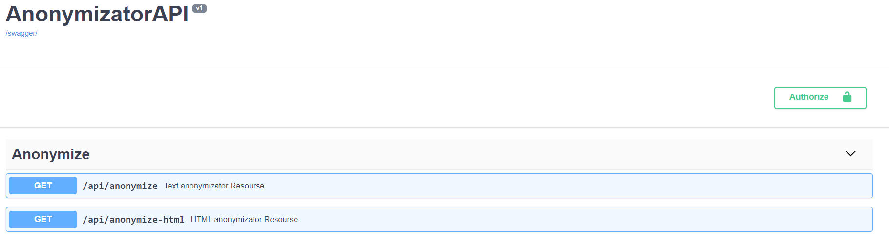

# Text-anonymizator

---


Hands-on project on text anonymization  via SpaCy and Presidio. 

Impemplemented simple API via flask-restful for *web-pages (html)* anonymization from news portal ria.ru

To setup application run:

```
 $ cd text-anonymizator
 $ docker-compose up -d --build
```
Then go to ```{localhost}:5000/swagger-ui```. 

For testing html-anonymization use GET ```/api/anonymize-html``` method or  GET ```/api/anonymize``` for plain text.

---

